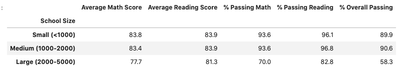
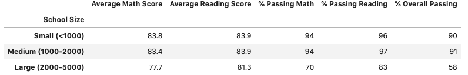
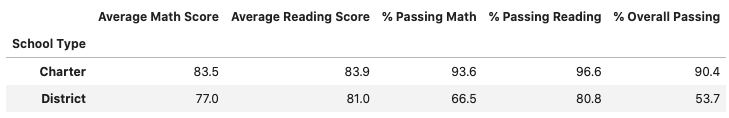
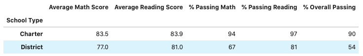

# School District Analysis
### Overview of the school distrcit analysis
##### The purpose of this analysis is to catch potential dishonesty (specifically reading and math grades for Thomas High School ninth graders). The comparisons will showcase difference between data with and without Thomas High School 9th graders math and reading scores. 
--- 
####Results: 
- How is the district summary affected?
  - The district summaries are the same. 
- How is the school summary affected? 
  - There is actually a big difference when taking 9th graders' scores out of the dataset. The overall passing percentage dropped from 90.95% to 65.08%.

(^ taken 9th graders out)

(with 9th graders scores)

- How does replacing the ninth graders' math and reading scores affect Thomas High School's performance relative to the other schools?
  - Replacing 9th graders; scores affected the Thomas High Schools's performance dramatically. However this does not affect other schools' performances because they are independent from each other. 
- How does replacing the nitnh-grade scores affect the following:
  - Math and reading scores by grade: From my observation, nothing changed, except for the cell where 9th graders' math scores from Thomas High School were taken out of dataset (NaN.)
  - Scores by school spending: Same as this one. Only the cell where 9th graders' reading score from Thomas High School were taken out of dataset (NaN.)
  - Scores by School size: It seems seems like all the average scores, and passing rates are almost the same. There is no significant differences.

  
  (^ taken 9th graders out)
  
  
  (^ with 9th graders scores)
  
  - Scores by school type: With both of the comparisons, it does not seem like dropping THS 9th graders' scores affacts too much of the overall data categorized by school types. 

  
    
  (^ taken 9th graders out)
  
  
  (^ with 9th graders scores)
 
 
 #### Summary:
 The overall analysis tells me there isn't too much of a difference when we are looking from a higher persepctives. The perspectives includes the four changes: math and reading scores by grade, scores by school spending, scores by school size, and scores by school type. This analysis shows that there is no evidence of academic dishonesty for ninth graders for Thomas High School. 